# Velour — UK E-Commerce Microservices Platform

Velour is a full-stack UK online marketplace built on a microservices architecture. It sells products across 16 categories — electronics, fashion, beauty, home, sports, and more — and includes **Vera**, an AI-powered shopping assistant built with the **Google Agent Development Kit (ADK)** and **Mistral Large**. Vera helps customers find products, track orders, add items to their basket, and get support through an intelligent floating chat interface.

The backend is composed of five independent FastAPI services. The frontend is a React single-page application served by Nginx, which also acts as an API gateway — routing all browser requests through a single port so no service ports need to be exposed to users.

---

## Table of Contents

1. [Features](#features)
2. [Platform Architecture](#platform-architecture)
3. [Repository Structure](#repository-structure)
4. [Services Overview](#services-overview)
5. [Technology Stack](#technology-stack)
6. [Prerequisites](#prerequisites)
7. [Getting Started](#getting-started)
8. [Environment Variables](#environment-variables)
9. [API Reference](#api-reference)
10. [Frontend Pages](#frontend-pages)
11. [AI Assistant — Vera](#ai-assistant--vera)
    - [Agentic Architecture](#agentic-architecture)
    - [Use Cases — Agent Flow Diagrams](#use-cases--agent-flow-diagrams)
12. [Search System](#search-system)
13. [Database Schema](#database-schema)
14. [Troubleshooting](#troubleshooting)

---

## Features

- **Product catalogue** — 685 products seeded from JSON into MongoDB on first run, spanning 16 categories
- **Free-text search** — natural language price constraints (e.g. "wireless headphones under £50"), category alias resolution, and multi-factor relevance scoring
- **Authentication** — JWT-based register and login; tokens expire after 30 minutes
- **Shopping cart** — add, remove, and update items; stock is validated and decremented atomically on each operation
- **Checkout and orders** — place orders with a choice of payment method; view full order history
- **Vera AI Shopping Assistant** — agentic chat widget powered by Google ADK + Mistral Large; shows clickable product cards with images, ratings, and prices; multi-agent coordinator routes requests to specialist agents for discovery, orders, cart, and policy
- **UK localisation** — all prices in GBP (£) converted from source INR data at 106:1; `en-GB` date and number formatting
- **Responsive design** — works on desktop and mobile; Poppins body font, Playfair Display for headings

---

## Platform Architecture

All browser traffic enters through port 3000. Nginx serves the React application for page requests and proxies all `/api/*` requests to the appropriate backend service. Services communicate over Docker's internal bridge network and are never directly reachable from the browser.

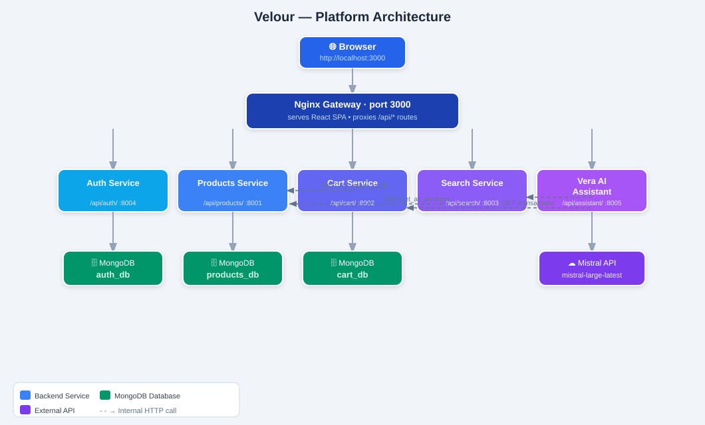

**Key design decisions:**

- **Single entry point.** Routing everything through the Nginx gateway eliminates CORS issues — all API requests come from the same origin (port 3000). Backend services require no `Access-Control-Allow-Origin` headers.
- **Database isolation.** Each service owns its own MongoDB database (`auth_db`, `products_db`, `cart_db`). No service queries another service's database directly; data is shared only through HTTP API calls.
- **Atomic stock updates.** When the Cart Service adds an item, it calls `PATCH /update_stock` on the Products Service using a single MongoDB `find_one_and_update` with filter `{ stock: { $gte: quantity } }`, ensuring two simultaneous buyers of the last item cannot both succeed — one receives HTTP 409 Conflict.
- **JWT ownership checks.** Cart endpoints extract `user_id` from the JWT and verify it matches the `user_id` in the request URL, so a logged-in user cannot access or modify another user's cart.

---

## Repository Structure

```
Ecommerce-Microservices/
│
├── ecommerce-auth/                 # Authentication service
│   ├── app/
│   │   ├── main.py                 # FastAPI app, CORS, router mount
│   │   ├── routes/user.py          # POST /register and POST /login
│   │   ├── auth.py                 # bcrypt hashing + JWT creation/decoding
│   │   ├── models.py               # Pydantic models: UserRegister, UserLogin
│   │   ├── database.py             # MongoDB connection → auth_db
│   │   └── config.py               # Environment variable loading
│   ├── Dockerfile
│   └── requirements.txt
│
├── products/                       # Product catalogue service
│   ├── main.py                     # All product CRUD endpoints
│   ├── models.py                   # Product Pydantic model
│   ├── dependencies/auth.py        # Reusable JWT verification dependency
│   ├── Dockerfile
│   └── requirements.txt
│
├── cart/                           # Cart and order service
│   ├── main.py                     # App factory: mounts routers, DB, CORS
│   ├── models.py                   # CartItem, Order, PaymentMethod models
│   ├── routers/
│   │   ├── cart.py                 # Cart management endpoints
│   │   └── orders.py               # Checkout and order history endpoints
│   ├── dependencies/auth.py        # JWT verification dependency
│   ├── Dockerfile
│   └── requirements.txt
│
├── recommendation_and_search_system/
│   ├── main.py                     # Search scoring engine + recommendations
│   ├── models.py                   # Product Pydantic model
│   ├── Dockerfile
│   └── requirements.txt
│
├── ai_assistant/                   # Vera AI shopping assistant (Google ADK)
│   ├── main.py                     # FastAPI app, ADK Runner, /chat endpoint
│   ├── agents.py                   # Coordinator + 4 specialist agents
│   ├── tools.py                    # 7 ADK tool functions
│   ├── services.py                 # HTTP calls to Velour services + price helpers
│   ├── model.py                    # Mistral model factory (LiteLLM)
│   ├── Dockerfile
│   └── requirements.txt
│
├── mongo-init/                     # One-time database seeding
│   ├── seed.py                     # Reads products.json, inserts into products_db
│   ├── products.json               # 685 product records (source data in INR)
│   └── Dockerfile
│
├── Frontend/                       # React single-page application
│   ├── src/
│   │   ├── App.js                  # Root component, React Router, context providers
│   │   ├── pages/                  # One component per route (9 pages)
│   │   ├── components/             # Header, Footer, ProductCard, ChatWidget, etc.
│   │   ├── context/
│   │   │   ├── AuthContext.js      # Global auth state (user, token, login, logout)
│   │   │   └── CartContext.js      # Global cart state with localStorage persistence
│   │   ├── services/api.js         # Axios instances using relative /api/* paths
│   │   └── utils/priceUtils.js     # toGBP() and formatPrice() helpers
│   ├── nginx.conf                  # API gateway proxy rules + SPA fallback
│   ├── Dockerfile                  # Multi-stage: Node 18 build → Nginx alpine
│   └── package.json
│
├── docs/                           # Architecture diagrams
│   ├── architecture-platform.svg   # Platform overview diagram
│   ├── architecture-vera.svg       # Vera multi-agent architecture diagram
│   └── vera-cart-flow.svg          # Cart propose/confirm flow diagram
│
├── docker-compose.yml              # Orchestrates all containers
└── README.md
```

---

## Services Overview

### 1. Auth Service

**Internal port:** 8000 | **Gateway path:** `/api/auth/`

Handles user registration and login. Passwords are hashed with **bcrypt** before being stored — plain-text passwords are never persisted. On successful register or login, the service issues a signed JWT containing the user's email and MongoDB `_id`. This token is used for all subsequent authenticated requests.

Tokens are signed with **HS256** using `JWT_SECRET_KEY` and expire after 30 minutes.

---

### 2. Products Service

**Internal port:** 8000 | **Gateway path:** `/api/products/`

Manages the full product catalogue. On first startup, 685 products are inserted into `products_db` by the seed container.

- **Read endpoints** (`GET`) are public — no authentication required.
- **Write endpoints** (`PUT`, `POST`, `DELETE`) require a valid JWT.
- **Stock updates** (`PATCH /update_stock`) are called internally by the Cart Service. The update is atomic: MongoDB's `find_one_and_update` with a conditional filter ensures stock never goes below zero under concurrent requests. If stock is insufficient the endpoint returns **HTTP 409 Conflict**.

---

### 3. Cart Service

**Internal port:** 8000 | **Gateway path:** `/api/cart/`

Manages shopping carts and completed orders, split into two routers:

- **`routers/cart.py`** — cart state: add, remove, fetch, and clear items.
- **`routers/orders.py`** — permanent records: place orders, fetch order history.

All endpoints require a valid JWT. The service extracts `user_id` from the token and verifies it matches the URL parameter — a user cannot access another user's cart.

When an item is added, the service validates stock and calls `PATCH /update_stock` on the Products Service to atomically decrement it. Removing an item restores the stock.

---

### 4. Search and Recommendations Service

**Internal port:** 8000 | **Gateway path:** `/api/search/`

Provides two public endpoints:

- **Product search** — accepts a free-text query and scores every product using a local multi-factor algorithm (see [Search System](#search-system)).
- **Category recommendations** — fetches all in-stock products, groups by `main_category`, and returns top-rated products per category for the homepage.

This service has **no direct database connection** — all product data is retrieved via the Products Service API.

---

### 5. AI Assistant Service — Vera

**Internal port:** 8000 | **Gateway path:** `/api/assistant/`

Powers the floating chat widget on every page. Built with **Google ADK 2.2** and **Mistral Large** via LiteLLM. See the full [AI Assistant — Vera](#ai-assistant--vera) section for architecture details.

---

## Technology Stack

| Layer | Technology |
|-------|-----------|
| Frontend framework | React 18, React Router v6 |
| Frontend HTTP | Axios (relative `/api/*` paths — no hardcoded ports) |
| UI icons | FontAwesome 6 |
| Fonts | Poppins (body), Playfair Display (headings) — Google Fonts |
| Backend framework | FastAPI 0.115, Python 3.11, Uvicorn |
| Password hashing | bcrypt via passlib |
| Authentication | JWT (HS256) via python-jose |
| Database | MongoDB 7 |
| Async DB driver | Motor 3.7 |
| Inter-service HTTP | httpx 0.28 (async) |
| AI assistant framework | Google Agent Development Kit (ADK) 2.2 |
| AI assistant model | Mistral Large (`mistral-large-latest`) via LiteLLM |
| Search engine | Custom local scoring (primary); Hugging Face sentence-transformers (optional fallback) |
| Web server / gateway | Nginx alpine |
| Containerisation | Docker, Docker Compose |

---

## Prerequisites

Before running the project, make sure the following are installed:

- **Docker** — [Install Docker](https://docs.docker.com/get-docker/)
- **Docker Compose** — included with Docker Desktop on Mac and Windows; install separately on Linux

You do not need Python, Node.js, or MongoDB installed locally — everything runs inside Docker containers.

You will also need:

- A **Mistral API key** for the Vera AI assistant. Sign up at [console.mistral.ai](https://console.mistral.ai) and create an API key. `mistral-large-latest` is a paid, per-token model with no daily request cap.

---

## Getting Started

### Step 1 — Clone the repository

```bash
git clone https://github.com/Lohit20/Ecommerce-Microservices.git
cd Ecommerce-Microservices
```

### Step 2 — Create your environment file

Create a file named `.env` in the root directory (the same folder as `docker-compose.yml`):

```env
# Secret key used to sign and verify JWT tokens.
# Replace with any long random string — keep it secret.
JWT_SECRET_KEY=replace_this_with_a_long_random_secret_string

# Your Mistral API key for the Vera AI assistant.
# Get one at: https://console.mistral.ai
MISTRAL_API_KEY=your_mistral_api_key_here

# (Optional) Override the Mistral model. Default is mistral-large-latest.
# MISTRAL_MODEL_TAG=mistral-large-latest
```

> **Security note:** Never commit your `.env` file to version control. The `JWT_SECRET_KEY` default in `docker-compose.yml` is intentionally weak — always override it via `.env`.

### Step 3 — Build and start all services

```bash
docker-compose up --build
```

The first run takes approximately 2–3 minutes as Docker builds all images and seeds the database. When you see Nginx logs from the `frontend` container, everything is ready.

On subsequent runs (images already built, database already seeded):

```bash
docker-compose up
```

### Step 4 — Open the application

Visit **[http://localhost:3000](http://localhost:3000)** in your browser.

That is the only URL you need. The website, APIs, and AI assistant are all accessible through port 3000.

---

### Startup Order

Docker Compose starts containers in a specific order:

1. **MongoDB** — starts first; containers wait until its health check passes
2. **Seed container** — inserts 685 products into `products_db` then exits; skips if data already exists
3. **Products Service** — starts after seed completes
4. **Auth Service** — starts after MongoDB is healthy
5. **Cart Service** — starts after Products Service
6. **Recommendation Service** — starts after Products Service
7. **AI Assistant Service** — starts after Products and Cart services
8. **Frontend** — starts last, after all backend services

---

### Stopping the application

```bash
# Stop all containers
docker-compose down

# Stop and wipe all data (fresh start)
docker-compose down -v
```

---

## Environment Variables

| Variable | Used By | Description | Default |
|----------|---------|-------------|---------|
| `JWT_SECRET_KEY` | Auth, Products, Cart | Secret key for JWT signing — must match across all services | `supersecretkey_changeme_in_production` |
| `ALGORITHM` | Auth, Products, Cart | JWT signing algorithm | `HS256` |
| `ACCESS_TOKEN_EXPIRE_MINUTES` | Auth | Token validity duration | `30` |
| `MONGO_URI` | Auth, Products, Cart | MongoDB connection string | `mongodb://mongodb:27017` |
| `MISTRAL_API_KEY` | Assistant | Mistral API key for Vera | *(must be set)* |
| `MISTRAL_MODEL_TAG` | Assistant | Mistral model to use | `mistral-large-latest` |
| `PRODUCTS_SERVICE_URL` | Cart, Recommendation, Assistant | Internal URL of the Products Service | `http://products_service:8000` |
| `CART_SERVICE_URL` | Assistant | Internal URL of the Cart Service | `http://cart_service:8000` |
| `RECOMMENDATION_SERVICE_URL` | Assistant | Internal URL of the Search Service | `http://recommendation_service:8000` |
| `INR_TO_GBP_RATE` | Assistant | INR to GBP conversion rate | `106` |
| `TOOL_HTTP_TIMEOUT` | Assistant | Timeout in seconds for service HTTP calls | `12` |
| `HF_API_TOKEN` | Recommendation | Hugging Face token for optional semantic fallback | *(empty — not required)* |

---

## API Reference

All endpoints are accessed through the Nginx gateway at `http://localhost:3000`. The gateway strips the `/api/<service>/` prefix before forwarding to the backend.

Individual service ports (8001–8005) are also exposed for development.

---

### Authentication — `/api/auth/`

#### Register

```
POST /api/auth/auth/register
```

```json
{
  "username": "jane_smith",
  "email": "jane@example.co.uk",
  "password": "yourpassword",
  "address": "42 Baker Street, London, W1U 7BW",
  "phone_number": "+44 7700 900123"
}
```

**Response (200):** `{ "token": "...", "token_type": "bearer", "user": { ... } }`  
**Error:** `400` — email already registered

---

#### Login

```
POST /api/auth/auth/login
```

```json
{ "email": "jane@example.co.uk", "password": "yourpassword" }
```

**Response (200):** Same shape as register.  
**Error:** `401` — incorrect email or password

---

### Products — `/api/products/`

| Method | Path | Auth | Description |
|--------|------|------|-------------|
| `GET` | `/get_all_products/` | No | All 685 products |
| `GET` | `/get_product/{product_id}` | No | Single product by ID |
| `PATCH` | `/update_stock/{product_id}` | No | Atomic stock update (internal use by Cart Service) |
| `PUT` | `/update_product/{product_id}` | JWT | Update product fields |
| `POST` | `/insert_new_product/` | JWT | Add a new product |
| `DELETE` | `/delete_product/{product_id}` | JWT | Delete a product |

**Stock update body:** `{ "quantity": -1 }` — negative to decrement, positive to restore.  
**Error:** `409 Conflict` if insufficient stock.

---

### Cart and Orders — `/api/cart/`

All endpoints require `Authorization: Bearer <token>`. The `user_id` in the JWT must match the `{user_id}` in the URL path.

| Method | Path | Description |
|--------|------|-------------|
| `GET` | `/cart/{user_id}` | Get current cart contents |
| `POST` | `/cart/{user_id}/add` | Add items to cart |
| `POST` | `/cart/{user_id}/remove/{product_id}` | Remove an item from cart |
| `POST` | `/cart/{user_id}/clear` | Clear the entire cart |
| `POST` | `/checkout/{user_id}` | Place an order |
| `GET` | `/transactions/{user_id}` | Get order history |

**Add items body:** `[{ "product_id": 83919804, "quantity": 1 }]`  
**Checkout body:** `"credit_card"` — available methods: `credit_card`, `paypal`, `cod`

---

### Search and Recommendations — `/api/search/`

| Method | Path | Description |
|--------|------|-------------|
| `GET` | `/product_semantic_search?query=&top_k=` | Search products |
| `GET` | `/recommendations?top_n=` | Top-rated products per category |

---

### AI Assistant — `/api/assistant/`

#### Health check

```
GET /api/assistant/health
```

```json
{
  "status": "ok",
  "provider": "mistral",
  "model": "mistral-large-latest",
  "api_key_configured": true,
  "mode": "adk-coordinator"
}
```

#### Chat

```
POST /api/assistant/chat
```

**Request:**
```json
{
  "message": "I want headphones under £50",
  "history": [
    { "role": "user", "content": "Hi" },
    { "role": "assistant", "content": "Hello! How can I help?" }
  ],
  "product_context": null,
  "user_id": null,
  "auth_token": null
}
```

**Response:**
```json
{
  "response": "Here are some great picks for you!",
  "options": ["Wireless", "Wired", "Noise-cancelling"],
  "products": [
    {
      "product_id": 46354382,
      "name": "boAt Rockerz 330 Bluetooth Wireless Earphones",
      "image": "https://...",
      "sub_category": "Headphones",
      "price": 10.37,
      "was": 37.64,
      "discount_pct": 72,
      "rating": 4.1,
      "no_of_ratings": 114950,
      "stock": 54
    }
  ]
}
```

---

## Frontend Pages

| Route | Page | Login Required |
|-------|------|----------------|
| `/` | **Home** — hero banner, category grid, live search, Top Rated and Best Deals strips | No |
| `/shop` | **All Products** — full catalogue with category, price, and rating filters | No |
| `/product/:id` | **Product Detail** — image, description, rating, stock, quantity selector, Add to Cart | No |
| `/category/:name` | **Category Page** — products for one category with price slider | No |
| `/cart` | **Cart** — item list, quantity controls, subtotal, proceed to checkout | No |
| `/checkout` | **Checkout** — payment selection, order summary, place order | Yes |
| `/account` | **Account** — order history, account details | Yes |
| `/login` | **Login** | No |
| `/register` | **Register** | No |

Login-required pages redirect to `/login` and return to the original destination after sign-in.

---

## AI Assistant — Vera

Vera is the AI shopping assistant integrated into every page as a floating chat bubble (bottom-right corner). It is built on the **Google Agent Development Kit (ADK)** with **Mistral Large** as the language model, accessed via LiteLLM.

### Agentic Architecture

Unlike a simple chat API call, Vera is a **multi-agent system**. A top-level Coordinator agent reads every message and routes it to the appropriate specialist. Each specialist is its own LLM-powered agent with a narrow responsibility and a focused set of tools.

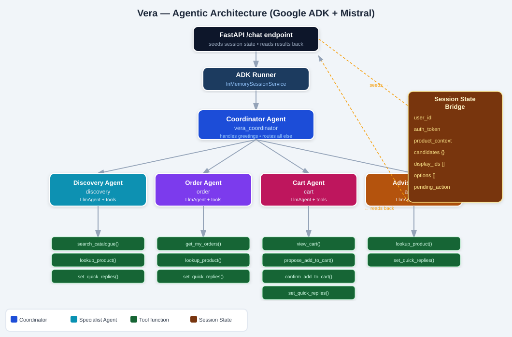

#### The Coordinator — `vera_coordinator`

The single entry point for all reasoning. It reads the shopper's message, decides which specialist handles it, and delegates via ADK's `transfer_to_agent` mechanism. It handles greetings itself; everything else is routed. It never calls Velour services directly.

#### The Specialist Agents

| Agent | Responsibility | Tools |
|-------|---------------|-------|
| **Discovery** | Search the catalogue, browse categories, compare products, filter by budget, give recommendations | `search_catalogue`, `lookup_product`, `set_quick_replies` |
| **Order** | Fetch and summarise the shopper's past orders and order status | `get_my_orders`, `lookup_product`, `set_quick_replies` |
| **Cart** | View the basket, propose adding an item, confirm additions, handle checkout | `view_cart`, `propose_add_to_cart`, `confirm_add_to_cart`, `set_quick_replies` |
| **Advisor** | Answer policy, delivery, returns, and support questions; answer questions about the current product page | `lookup_product`, `set_quick_replies` |

#### The Session-State Bridge

ADK agents communicate in natural language, but the Velour frontend needs structured data — product cards, quick-reply buttons. The solution is a **session state bridge**: tools write structured results into a shared dictionary as a side effect of their work.

| Key | Type | Set by | Purpose |
|-----|------|--------|---------|
| `user_id` | string \| null | FastAPI (seeded) | Shopper's database ID — read by order and cart tools |
| `auth_token` | string \| null | FastAPI (seeded) | Shopper's JWT — read by order and cart tools |
| `product_context` | object \| null | FastAPI (seeded) | Product the shopper is currently viewing |
| `candidates` | object | Discovery, Cart tools | Full product cards gathered this turn, keyed by product ID |
| `display_ids` | list | Discovery, Cart tools | Product IDs to show as cards, in order |
| `options` | list | Any tool | Quick-reply button labels |
| `pending_action` | object \| null | Cart tools | A cart addition awaiting the shopper's confirmation |

After the ADK run finishes, FastAPI reads `candidates`, `display_ids`, and `options` from session state and assembles them into the `products` and `options` fields of the response — without the agents ever formatting JSON.

### The Cart — Human-in-the-Loop Two-Turn Flow

Adding to the cart is the one action that changes real data, so it always requires the shopper's explicit confirmation. The Cart agent never adds an item unilaterally.

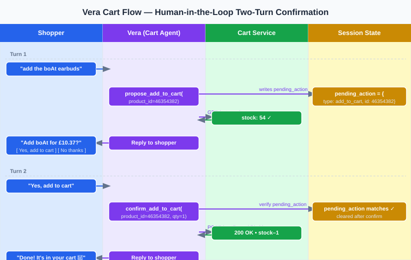

**Turn 1 — Propose:**
1. The shopper says something like "add the boAt earbuds to my cart."
2. The Cart agent calls `propose_add_to_cart(product_id)`.
3. The tool checks stock and writes a `pending_action` to session state — but does **not** touch the cart.
4. The agent asks the shopper to confirm; "Yes, add to cart" and "No thanks" buttons appear.

**Turn 2 — Confirm:**
1. The shopper taps "Yes, add to cart."
2. The Cart agent calls `confirm_add_to_cart(product_id, quantity=1)`.
3. The tool verifies a matching `pending_action` exists (a safety gate), then calls the Cart Service.
4. The agent confirms the item is in the basket and offers "Go to checkout" and "Keep shopping."

This two-layer safety design means even if the model misbehaves and tries to call `confirm_add_to_cart` without a prior proposal, the tool's own check prevents an unwanted purchase.

### What Vera Can Do

| Query | Example | What happens |
|-------|---------|--------------|
| Product search | "I want wireless earbuds under £40" | Discovery agent searches catalogue, returns product cards |
| Clarifying questions | "I want a shirt" | Discovery agent asks follow-up questions via option buttons |
| Product Q&A | On a product page | Advisor agent answers using that product's data |
| Order history | "Where's my order?" (signed in) | Order agent fetches and summarises recent orders |
| Cart addition | "Add this to my cart" | Cart agent runs the two-turn propose/confirm flow |
| Policy questions | "What's your return policy?" | Advisor agent answers from its instruction — no tool call needed |
| Greetings | "Hi" / "Hello" | Coordinator handles directly; shows quick-reply suggestion buttons |
| Compound request | "Find earbuds and add the cheapest" | Discovery + Cart agents invoked in sequence by the Coordinator |

---

### Use Cases — Agent Flow Diagrams

Each diagram shows the exact path a message takes through the multi-agent system: from the user's input through the Coordinator, into the specialist agent, through its tools, and back as a structured response.

---

#### UC-1 — Greeting

The Coordinator recognises a greeting or small talk and handles it directly without delegating to any specialist. It calls `set_quick_replies` to surface the four main entry points as tappable buttons.

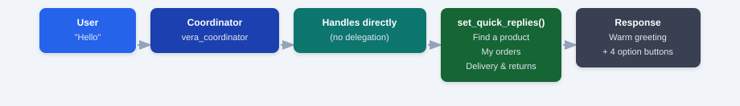

**Agents involved:** Coordinator only  
**Tools called:** `set_quick_replies`  
**Output:** Warm welcome message + 4 quick-reply buttons (Find a product · My orders · Delivery & returns · Gift ideas)

---

#### UC-2 — Specific Product Search

The shopper gives a clear query — optionally with a price limit. The Coordinator routes to the Discovery agent, which passes the query verbatim to the Search Service and writes the results into session state as product cards.

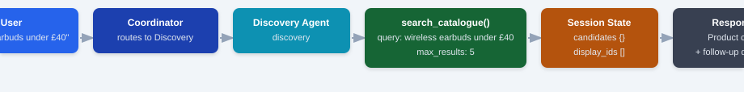

**Agents involved:** Coordinator → Discovery  
**Tools called:** `search_catalogue`  
**Output:** Up to 8 product cards with prices in GBP, ratings, discounts + a highlight and follow-up question

---

#### UC-3 — Vague Search with Clarifying Question

When a query is too broad (e.g. "I want a shirt"), the Discovery agent does not search immediately. It first calls `set_quick_replies` with sensible options. Once the shopper picks one, the next turn triggers a real search.

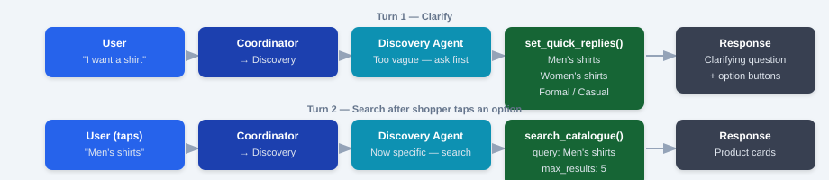

**Agents involved:** Coordinator → Discovery (two turns)  
**Tools called (turn 1):** `set_quick_replies`  
**Tools called (turn 2):** `search_catalogue`  
**Output (turn 1):** Clarifying question + option buttons · **(turn 2):** Product cards

---

#### UC-4 — Policy / Delivery / Returns Question

Questions about Velour's policies are routed to the Advisor agent, which answers directly from its instruction. No tool call is needed — the policy facts are baked into the agent's prompt.

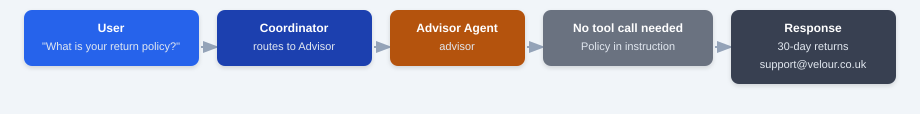

**Agents involved:** Coordinator → Advisor  
**Tools called:** None  
**Output:** Direct answer (free delivery over £50 · 30-day returns · 2–5 day delivery · support contact)

---

#### UC-5 — Product Page Q&A

When the shopper is on a product detail page, the frontend sends the full product record as `product_context`. The Advisor agent calls `lookup_product` to get complete details and answers questions about that specific item.

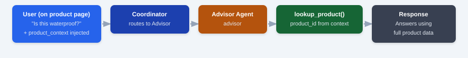

**Agents involved:** Coordinator → Advisor  
**Tools called:** `lookup_product`  
**Output:** Answer grounded in the actual product data (materials, specs, stock, price)

---

#### UC-6 — Order History (Signed In)

The Order agent reads `user_id` and `auth_token` from session state (seeded by FastAPI at the start of the request), calls the Cart Service, and returns a summary of the three most recent orders.

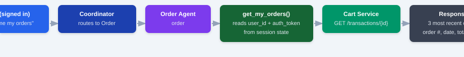

**Agents involved:** Coordinator → Order  
**Tools called:** `get_my_orders`  
**Output:** Last 3 orders — order number, date, total in GBP, item names

---

#### UC-7 — Order History (Not Signed In)

If no `user_id` or `auth_token` is present in session state, `get_my_orders` immediately returns `{ "logged_in": false }`. The Order agent asks the shopper to sign in and surfaces a quick-reply button.

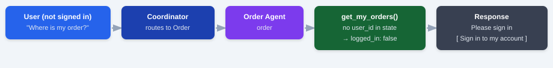

**Agents involved:** Coordinator → Order  
**Tools called:** `get_my_orders` (returns early)  
**Output:** "Please sign in to view your orders" + [ Sign in to my account ] button

---

#### UC-8 — View Cart

The Cart agent calls `view_cart`, which reads the shopper's basket from the Cart Service and returns a formatted summary including item count and estimated total in GBP.

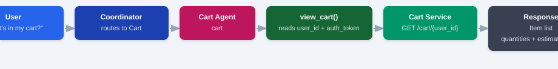

**Agents involved:** Coordinator → Cart  
**Tools called:** `view_cart`  
**Output:** Cart contents with quantities and estimated total, or "your cart is empty"

---

#### UC-9 — Add to Cart (Two-Turn Flow)

The safest use case. The Cart agent **never** adds an item in a single step — it always proposes first, waits for the shopper's explicit confirmation, then executes. See the [detailed cart flow diagram](#the-cart--human-in-the-loop-two-turn-flow) above for the full sequence.

**Agents involved:** Coordinator → Cart (across two request turns)  
**Tools called (turn 1):** `propose_add_to_cart` → writes `pending_action` to session state  
**Tools called (turn 2):** `confirm_add_to_cart` → verifies pending action → calls Cart Service  
**Output (turn 1):** "Add [product] for £X.XX?" + [ Yes, add to cart ] [ No thanks ]  
**Output (turn 2):** "Done! It's in your cart 🛒" + [ Go to checkout ] [ Keep shopping ]

---

#### UC-10 — Compound Request (Multiple Agents in Sequence)

A single message can require more than one specialist. The Coordinator recognises both intents and delegates to each agent in sequence — Discovery first to find the products, then Cart to propose adding the cheapest result.

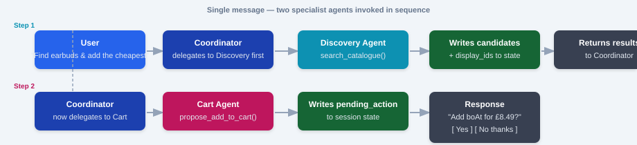

**Agents involved:** Coordinator → Discovery → Cart (same turn)  
**Tools called:** `search_catalogue` (Discovery), then `propose_add_to_cart` (Cart)  
**Output:** Product cards shown, then confirmation prompt for the cheapest item

---

### Technical Stack

| Component | Technology |
|-----------|-----------|
| Agent framework | Google Agent Development Kit (ADK) 2.2 |
| Language model | Mistral Large (`mistral-large-latest`) |
| LLM bridge | LiteLLM (via ADK's `LiteLlm` wrapper) |
| Session storage | `InMemorySessionService` (stateless per request; frontend re-sends history) |
| Service calls | httpx async (internal Docker network) |
| Structured output | Session-state bridge (no `output_schema` — agents use tools freely) |

---

## Search System

The search engine is built in Python inside the Recommendation Service. It scores every product against the query and returns the top matches — no external search index required.

### Scoring factors

| Signal | Points |
|--------|--------|
| Exact query phrase in product name | +150 |
| Each search word found in product name | +30 per word |
| Search word at start of product name | +10 bonus |
| Search word in sub-category | +22 per word |
| Search word in main category | +15 per word |
| Category alias match | +25 per word |
| Product is within the price ceiling | +40 bonus |
| Product is well over the price ceiling | ×0.15 penalty |
| Rating (tiebreaker) | rating × 4 |
| Popularity (tiebreaker) | up to +5 |
| Discount depth (tiebreaker) | up to +12 |

### Price constraint parsing

The engine automatically detects price limits in natural language:

```
"wireless headphones under £50"   → scores products priced ≤ £50
"laptop below £400"               → scores laptops priced ≤ £400
"yoga mat less than £25"          → scores mats priced ≤ £25
```

Patterns recognised: `under`, `below`, `less than`, `max`, `cheaper than`, `budget of` followed by an optional `£`/`$` and a number.

### Category aliases

Common words are mapped to canonical categories so searches like "headphones", "bluetooth", or "earphones" all correctly match "TV, Audio & Cameras":

| Search word | Category |
|-------------|----------|
| `headphones`, `earphones`, `bluetooth` | TV, Audio & Cameras |
| `kitchen`, `cookware` | Home & Kitchen |
| `yoga`, `gym`, `workout`, `running` | Sports & Fitness |
| `fridge`, `washing`, `microwave` | Appliances |
| `skincare`, `makeup`, `perfume` | Beauty & Health |
| `shoes`, `trainers`, `sneakers`, `boots` | Men's Shoes |

### Hugging Face fallback (optional)

If `HF_API_TOKEN` is configured and a query returns fewer than 6 local results, the service calls the Hugging Face `sentence-transformers/all-MiniLM-L6-v2` model for semantic similarity scoring. This is optional — the local engine works well on its own for most queries.

---

## Database Schema

Each service owns its own isolated MongoDB database. No service reads another's database directly.

### `auth_db.users`

| Field | Type | Notes |
|-------|------|-------|
| `_id` | ObjectId | Auto-generated primary key |
| `username` | String | Display name |
| `email` | String | Unique — login identifier |
| `password` | String | bcrypt hash — plain-text never stored |
| `address` | String | Delivery address |
| `phone_number` | String | Contact number |

### `products_db.products`

| Field | Type | Notes |
|-------|------|-------|
| `product_id` | Integer | Unique numeric ID (from source data) |
| `name` | String | Full product name |
| `main_category` | String | Top-level category |
| `sub_category` | String | More specific category |
| `image` | String | Product image URL |
| `ratings` | Float | Average star rating (0.0–5.0) |
| `no_of_ratings` | Integer | Total customer reviews |
| `actual_price` | Float | Original price in INR |
| `discount_price` | Float | Discounted price in INR |
| `stock` | Integer | Current stock level; atomically updated on cart operations |

All prices are stored in INR and converted to GBP at 106:1 by the frontend's `toGBP()` utility and by Vera's services layer.

### `cart_db.carts`

| Field | Type | Notes |
|-------|------|-------|
| `user_id` | String | MongoDB `_id` of the user |
| `items` | Array | `[{ product_id, quantity, price }]` |
| `updated_at` | DateTime | Last modification timestamp |

### `cart_db.transactions`

| Field | Type | Notes |
|-------|------|-------|
| `order_id` | Integer | Auto-incremented order number |
| `user_id` | String | MongoDB `_id` of the user |
| `product_cart` | Array | Snapshot at order time: `[{ product_id, name, quantity, price }]` |
| `total_amount` | Float | Total order value in INR |
| `payment_method` | String | `credit_card`, `paypal`, or `cod` |
| `created_at` | DateTime | Order placement timestamp |

---

## Troubleshooting

### Products are not showing on first run

The seed container needs MongoDB to be fully healthy before inserting data. Wait 30 seconds and refresh. If the problem persists, do a clean restart:

```bash
docker-compose down -v
docker-compose up --build
```

The `-v` flag removes the MongoDB data volume, forcing a fresh seed on the next start.

---

### Vera says "I'm a little busy right now"

This means the Mistral API returned a rate-limit error (HTTP 429). Vera retries automatically up to 3 times with increasing delays. If it persists, your account may have hit a concurrent-request limit — wait a moment and try again.

---

### Vera says "Sorry, I'm having a moment!"

This is the fallback for unexpected errors from the ADK or Mistral. Check the assistant service logs for details:

```bash
docker logs assistant_service
```

Common causes: invalid `MISTRAL_API_KEY` in `.env`, Mistral API outage, or a network issue between the assistant container and the internet.

---

### Login stops working after a restart

JWT tokens expire after 30 minutes. If you see "invalid token" immediately after logging in, the `JWT_SECRET_KEY` in your `.env` file may have changed between runs. Clear browser localStorage (DevTools → Application → Local Storage → clear all) and log in again.

---

### Port 3000 is already in use

Change the port in `docker-compose.yml`:

```yaml
frontend:
  ports:
    - "3001:80"
```

Then access the site at `http://localhost:3001`.

---

### A backend service fails to start

Check service-specific logs:

```bash
docker logs products_service
docker logs cart_service
docker logs auth_service
docker logs recommendation_service
docker logs assistant_service
```

Common causes:
- MongoDB not yet healthy — the service will restart automatically
- Missing environment variable (`JWT_SECRET_KEY`, `MISTRAL_API_KEY`) in `.env`
- Missing Python dependency — run `docker-compose up --build` to rebuild

---

### Direct service URLs (for development)

| Service | Direct URL | Swagger UI |
|---------|-----------|------------|
| Auth | `http://localhost:8004` | `http://localhost:8004/docs` |
| Products | `http://localhost:8001` | `http://localhost:8001/docs` |
| Cart | `http://localhost:8002` | `http://localhost:8002/docs` |
| Search | `http://localhost:8003` | `http://localhost:8003/docs` |
| Assistant | `http://localhost:8005` | `http://localhost:8005/docs` |
